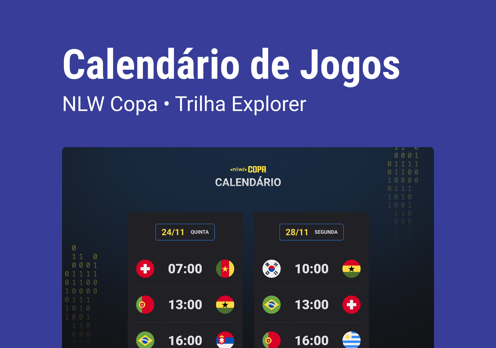

<h1 align="center"> NLW Rocketseat #10 - Copa 2022</h1>

Evento exclusivo e gratuito, promovido pela Rocketseat para ensino de tecnologias WEB.

  <a href="#-tecnologias">Tecnologias</a>&nbsp;&nbsp;&nbsp;|&nbsp;&nbsp;&nbsp;
  <a href="#-projeto">Projeto</a>&nbsp;&nbsp;&nbsp;|&nbsp;&nbsp;&nbsp;
  <a href="#-layout">Layout</a>&nbsp;&nbsp;&nbsp;|&nbsp;&nbsp;&nbsp;
  <a href="#memo-licença">Licença</a>

 

  

## 🚀 Tecnologias

Esse projeto foi desenvolvido com as seguintes tecnologias:

- HTML
- CSS
- JavaScript
- Git e Github

## 💻 Projeto

Calendário da Copa do Mundo FIFA 2022

## 🔖 Layout

Você pode visualizar o layout do projeto através [desse link](https://www.figma.com/file/TlWmM4rRXERNJCOHgGna3z/Calend%C3%A1rio-de-Jogos-(Community)). É necessário ter conta no [Figma](https://figma.com) para acessá-lo.

## 📝 Licença

Esse projeto está sob a licença MIT.

---
 

Feito com ♥ por Aylmer Bolzan 👋  
[Participe da  comunidade Rocketseat no Discord!](https://discord.gg/rocketseat)